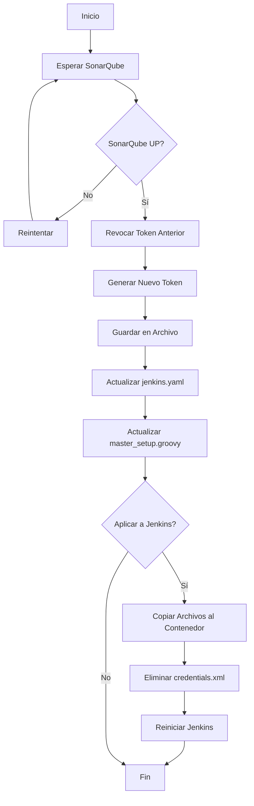

# 🔐 Generador Automático de Token de SonarQube

Este módulo automatiza completamente la creación y gestión de tokens de SonarQube para Jenkins.

## 📋 Contenido

- `generate-sonar-token.sh` - Script interactivo completo (uso local)
- `generate-and-update-token.sh` - Script automatizado (uso en contenedor)
- `Dockerfile` - Imagen para ejecutar el generador
- `README.md` - Esta documentación

## 🚀 Uso Rápido

### Opción 1: Script Local Interactivo

```bash
cd /home/miguel/Documentos/GitHub/cicdjenkins/scripts
./generate-sonar-token.sh
```

Este script:
1. ✅ Espera a que SonarQube esté disponible
2. ✅ Revoca el token anterior (si existe)
3. ✅ Genera un nuevo token
4. ✅ Actualiza `jenkins.yaml` y `master_setup.groovy`
5. ✅ Pregunta si deseas aplicar los cambios a Jenkins
6. ✅ Copia archivos al contenedor y reinicia Jenkins (opcional)

### Opción 2: Script Automatizado en Contenedor

```bash
# Construir imagen
cd /home/miguel/Documentos/GitHub/cicdjenkins/token-generator
docker build -t sonarqube-token-generator .

# Ejecutar (requiere red del stack)
docker run --rm --network=cicdjenkins_default \
  -e SONARQUBE_HOST=http://sonarqube:9000 \
  -e SONARQUBE_USER=admin \
  -e SONARQUBE_PASSWORD=@MiguelAngel05 \
  sonarqube-token-generator
```

### Opción 3: Docker Compose (Automático al iniciar el stack)

Agregar al `docker-compose.yml`:

```yaml
  token-generator:
    build: ./token-generator
    container_name: sonar-token-generator
    networks:
      - jenkins-network
    environment:
      - SONARQUBE_HOST=http://sonarqube:9000
      - SONARQUBE_USER=admin
      - SONARQUBE_PASSWORD=@MiguelAngel05
      - JENKINS_HOST=http://jenkins:8080
      - TOKEN_NAME=jenkins-global-analysis-token
    depends_on:
      - sonarqube
      - jenkins
    restart: "no"  # Solo ejecuta una vez al inicio
```

Luego:

```bash
docker-compose up -d
```

## 🔧 Variables de Entorno

| Variable | Descripción | Default |
|----------|-------------|---------|
| `SONARQUBE_HOST` | URL de SonarQube | `http://sonarqube:9000` |
| `SONARQUBE_USER` | Usuario admin | `admin` |
| `SONARQUBE_PASSWORD` | Contraseña admin | `@MiguelAngel05` |
| `JENKINS_HOST` | URL de Jenkins | `http://jenkins:8080` |
| `TOKEN_NAME` | Nombre del token | `jenkins-global-analysis-token` |
| `MAX_RETRIES` | Reintentos de conexión | `30` |
| `RETRY_INTERVAL` | Segundos entre reintentos | `10` |
| `OUTPUT_FILE` | Archivo de salida | `/tmp/sonarqube-token.txt` |

## 📖 API de SonarQube Utilizada

### 1. Verificar Estado del Sistema

```bash
GET /api/system/status
Authorization: Basic base64(admin:password)
```

**Respuesta:**
```json
{
  "status": "UP",
  "version": "25.11.0"
}
```

### 2. Listar Tokens Existentes

```bash
GET /api/user_tokens/search?login=admin
Authorization: Basic base64(admin:password)
```

**Respuesta:**
```json
{
  "userTokens": [
    {
      "name": "jenkins-global-analysis-token",
      "login": "admin",
      "createdAt": "2025-11-10T10:30:00+0000"
    }
  ]
}
```

### 3. Revocar Token

```bash
POST /api/user_tokens/revoke
Authorization: Basic base64(admin:password)
Content-Type: application/x-www-form-urlencoded

name=jenkins-global-analysis-token&login=admin
```

### 4. Generar Nuevo Token

```bash
POST /api/user_tokens/generate
Authorization: Basic base64(admin:password)
Content-Type: application/x-www-form-urlencoded

name=jenkins-global-analysis-token&login=admin
```

**Respuesta:**
```json
{
  "name": "jenkins-global-analysis-token",
  "login": "admin",
  "token": "squ_c9c4f98a83783fb601f4db5066f447ceafd0aa8b",
  "createdAt": "2025-11-10T11:00:00+0000"
}
```

## 🔄 Flujo de Trabajo



## 📝 Ejemplos de Uso

### Ejemplo 1: Generar Token al Levantar el Stack

```bash
# 1. Levantar servicios
cd /home/miguel/Documentos/GitHub/cicdjenkins
docker-compose up -d sonarqube jenkins

# 2. Esperar 30 segundos a que inicien
sleep 30

# 3. Generar token automáticamente
./scripts/generate-sonar-token.sh
```

### Ejemplo 2: Regenerar Token sin Interacción

```bash
export SONARQUBE_HOST=http://localhost:9001
export SONARQUBE_PASSWORD=@MiguelAngel05

./token-generator/generate-and-update-token.sh

# Token guardado en /tmp/sonarqube-token.txt
NEW_TOKEN=$(cat /tmp/sonarqube-token.txt)
echo "Nuevo token: $NEW_TOKEN"
```

### Ejemplo 3: Integración con Scripts de Inicialización

```bash
#!/bin/bash
# start-all.sh

# 1. Levantar servicios
docker-compose up -d

# 2. Generar token
./token-generator/generate-and-update-token.sh

# 3. Configurar webhook
./webhook-configurator/configure-webhook.sh

echo "✅ Stack completamente configurado"
```

## 🛠️ Construcción Manual

### Construir Imagen

```bash
cd /home/miguel/Documentos/GitHub/cicdjenkins/token-generator
docker build -t sonarqube-token-generator:latest .
```

### Ejecutar Contenedor

```bash
docker run --rm \
  --network=cicdjenkins_default \
  -e SONARQUBE_HOST=http://sonarqube:9000 \
  -e SONARQUBE_PASSWORD=@MiguelAngel05 \
  -v /tmp:/output \
  sonarqube-token-generator:latest
```

El token se guardará en `/tmp/sonarqube-token.txt` del host.

## 🔍 Troubleshooting

### Problema: "SonarQube no disponible"

**Solución:**
```bash
# Verificar que SonarQube esté corriendo
docker ps | grep sonarqube

# Verificar logs
docker logs sonarqube

# Verificar manualmente el endpoint
curl -u admin:@MiguelAngel05 http://localhost:9001/api/system/status
```

### Problema: "Error generando token"

**Causas posibles:**
1. Credenciales incorrectas
2. Token con el mismo nombre ya existe y no se pudo revocar
3. Permisos insuficientes

**Solución:**
```bash
# Verificar credenciales
curl -u admin:@MiguelAngel05 http://localhost:9001/api/authentication/validate

# Listar tokens existentes
curl -u admin:@MiguelAngel05 http://localhost:9001/api/user_tokens/search?login=admin

# Revocar manualmente
curl -X POST -u admin:@MiguelAngel05 \
  http://localhost:9001/api/user_tokens/revoke \
  -d "name=jenkins-global-analysis-token&login=admin"
```

### Problema: "Jenkins no aplica el nuevo token"

**Solución:**
```bash
# 1. Eliminar credentials.xml cacheado
podman exec jenkins rm -f /var/jenkins_home/credentials.xml

# 2. Copiar archivos actualizados
podman cp jenkins/jenkins.yaml jenkins:/var/jenkins_home/jenkins.yaml
podman cp jenkins/init.groovy.d/master_setup.groovy \
  jenkins:/var/jenkins_home/init.groovy.d/

# 3. Reiniciar Jenkins
podman restart jenkins

# 4. Esperar a que Jenkins se inicie
sleep 30

# 5. Verificar credencial
podman exec jenkins cat /var/jenkins_home/credentials.xml | grep sonar-token
```

## 🔐 Seguridad

### Mejores Prácticas

1. **No hardcodear passwords**: Usa variables de entorno
2. **Tokens de corta duración**: Regenera tokens periódicamente
3. **Un token por propósito**: No reutilices tokens
4. **Revoca tokens antiguos**: Limpia tokens no utilizados
5. **Logs sin tokens**: No registres tokens en logs

### Ejemplo: Usando Secretos de Docker

```yaml
services:
  token-generator:
    build: ./token-generator
    secrets:
      - sonarqube_password
    environment:
      - SONARQUBE_PASSWORD_FILE=/run/secrets/sonarqube_password

secrets:
  sonarqube_password:
    file: ./secrets/sonarqube_password.txt
```

## 📚 Referencias

- [SonarQube Web API](https://docs.sonarsource.com/sonarqube/latest/extension-guide/web-api/)
- [User Token API](https://next.sonarqube.com/sonarqube/web_api/api/user_tokens)
- [Jenkins Credentials Plugin](https://plugins.jenkins.io/credentials/)
- [Authentication in SonarQube](https://docs.sonarsource.com/sonarqube/latest/user-guide/user-account/)

## 🤝 Contribuir

Para mejorar este módulo:

1. Fork el repositorio
2. Crea una rama con tu feature
3. Haz commit de tus cambios
4. Push a la rama
5. Abre un Pull Request

## 📄 Licencia

Este script es parte del proyecto CI/CD con Jenkins y SonarQube.

---

**Última actualización:** 2025-11-10  
**Autor:** Miguel Ángel  
**Versión:** 1.0.0

